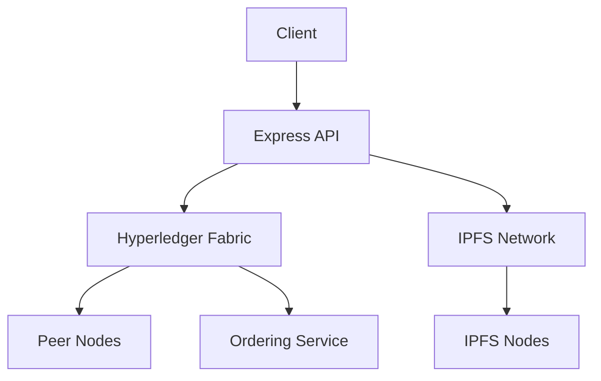

# Land Title Management System

A blockchain-based solution for managing land titles using Hyperledger Fabric and IPFS, providing secure and immutable property records management.

## Features

- **Hyperledger Fabric Integration**: Secure blockchain transactions for land title management
- **IPFS Storage**: Decentralized document storage using IPFS
- **JWT Authentication**: Secure API endpoints with JSON Web Tokens
- **Swagger Documentation**: Interactive API documentation
- **Organization Management**: Channel organization discovery and management
- **Multi-Org Support**: Built for multi-organization blockchain networks

## Technology Stack

- Hyperledger Fabric 2.5
- IPFS/Helia
- Node.js/TypeScript
- Express.js
- Swagger/OpenAPI 3.0

## Prerequisites

- Node.js v18+
- Go 1.20+
- Docker 20.10+
- Docker Compose 2.20+
- pnpm 8+
- Hyperledger Fabric Samples v2.5

## Installation

1. **Clone Repository**
```bash
git clone https://github.com/your-username/land-title-management.git
cd land-title-management/backend
```

2. **Install Dependencies**
```bash
pnpm install
```

3. **Set Up Hyperledger Fabric Network**

*cf*: Official documentation

## Configuration

### Required Files
Copy these from Fabric network to backend/crypto:

```
organizations/
├── peerOrganizations/
│   └── org1.example.com/
│       ├── msp/
│       │   └── admincerts/  # Admin certificates
│       └── users/Admin@org1.example.com/
│           └── msp/keystore/  # Private key
└── ordererOrganizations/
    └── example.com/
        └── msp/tlscacerts/  # TLS certificates
```

### Environment Variables
Create .env file in project root:

```bash
# Fabric Network
CHANNEL_NAME=mychannel
CHAINCODE_NAME=landtitle
PEER_ENDPOINT=localhost:7051
MSP_ID=Org1MSP

# Paths (relative to backend directory)
KEY_DIRECTORY_PATH=./crypto/peerOrganizations/org1.example.com/users/Admin@org1.example.com/msp/keystore
CERT_DIRECTORY_PATH=./crypto/peerOrganizations/org1.example.com/users/Admin@org1.example.com/msp/signcerts
TLS_CERT_PATH=./crypto/peerOrganizations/org1.example.com/peers/peer0.org1.example.com/tls/ca.crt

# Authentication
JWT_SECRET=your_secure_secret_here

# IPFS
IPFS_API_URL=/ip4/127.0.0.1/tcp/5001
```

## Running the Application

### Start Server
```bash
pnpm build && pnpm start
```

### Access APIs
- Swagger UI: http://localhost:3000/api-docs
- Swagger UI (json format): http://localhost:3000/api-docs.json
- API Base URL: http://localhost:3000/api

## API Documentation

### Key Endpoints

| Method | Endpoint | Description |
|--------|----------|-------------|
| POST | /auth/login | Get JWT token |
| POST | /api/landtitles | Create new land title |
| GET | /api/landtitles/{id} | Get land title details |
| PUT | /api/landtitles/{id} | Update land title ownership |
| GET | /api/organizations | List channel organizations |

### Example Request

```bash
# Get JWT Token
curl -X POST http://localhost:3000/auth/login \
  -H "Content-Type: application/json" \
  -d '{"username": "admin", "password": "adminpw"}'

# Create Land Title (using obtained token)
curl -X POST http://localhost:3000/api/landtitles \
  -H "Authorization: Bearer YOUR_JWT_TOKEN" \
  -H "Content-Type: application/json" \
  -d '{
    "id": "LAND123",
    "owner": "Alice",
    "description": "Beachfront villa",
    "value": 750000,
    "document": "BASE64_PDF_DATA",
    "timestamp": "2024-03-15T12:00:00Z"
  }'
```

## Architecture



## Troubleshooting

### Common Issues

**Certificate Errors**
- Verify paths in .env match actual certificate locations
- Ensure certificates are copied from Fabric network to crypto/ directory
- Regenerate crypto materials if needed:
```bash
./network.sh down
./network.sh up createChannel -c mychannel -ca
```

**CustomEvent Errors**
- Ensure polyfills are properly configured in server.ts
- Verify Node.js version is 18+

**Peer Connection Issues**
- Check Fabric network status:
```bash
docker ps -a
```
- Verify chaincode is deployed:
```bash
peer lifecycle chaincode queryinstalled
```


## References

- [Hyperledger Fabric Documentation](https://hyperledger-fabric.readthedocs.io/)
- [IPFS Documentation](https://docs.ipfs.tech/)
- [OpenAPI Specification](https://swagger.io/specification/)